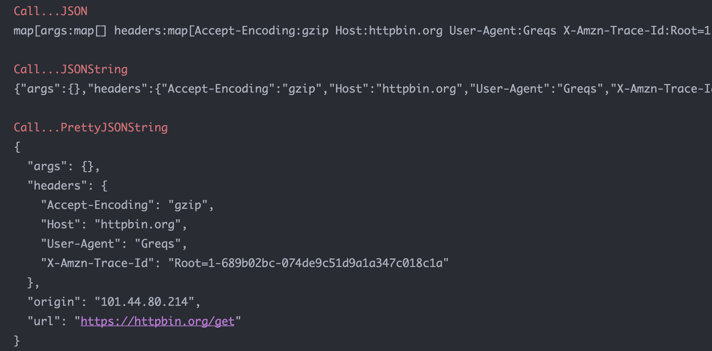

# Greqs

> 一个简洁、优雅、易用的 Go HTTP 请求库

## ✨ 特性

- 🚀 **简洁的 API** - 提供直观的函数调用方式
- 🎯 **类型安全** - 使用类型别名简化参数传递
- 🔧 **灵活配置** - 支持代理、超时、自定义请求头等
- 📦 **多种使用方式** - 快捷函数、Request 对象、Worker 实例
- 🎨 **彩色日志** - 内置彩色日志输出工具
- 📊 **便捷的响应处理** - 支持文本、JSON 等多种格式解析
- 🪝 **钩子支持** - Worker 支持请求前和客户端自定义钩子

## 📦 安装

```bash
go get -u github.com/markadc/greqs
```

## 🚀 快速开始

### 方式一：使用快捷函数

```go
package main

import (
    "fmt"

    "github.com/markadc/greqs"
    "github.com/markadc/greqs/log"
)

func main() {
    headers := greqs.S{"User-Agent": "Greqs"}

    // 发送 GET 请求
    url := "https://httpbin.org/get"
    r1, _ := greqs.Get(url, headers)
    fmt.Println(r1.StatusCode)
    log.Red(r1.Text())

    // 发送 POST JSON 请求
    url = "https://httpbin.org/post"
    data := greqs.A{"Type": "JSON", "Value": []int{1, 2, 3}}
    r2, _ := greqs.Post(url, headers, data)
    fmt.Println(r2.StatusCode)
    log.Yellow(r2.Text())

    // 发送 POST Form 请求
    url = "https://httpbin.org/post"
    form := greqs.S{"Type": "Form", "Name": "Greqs"}
    r3, _ := greqs.PostForm(url, headers, form)
    fmt.Println(r3.StatusCode)
    log.Blue(r3.Text())
}
```

### 方式二：使用 Request 对象

```go
package main

import (
    "fmt"
    "time"

    "github.com/markadc/greqs"
)

func main() {
    req := &greqs.Request{
        Method:  "GET",
        Url:     "https://httpbin.org/get",
        Params:  greqs.S{"page": "1", "limit": "10"},
        Headers: greqs.S{"User-Agent": "Greqs"},
        Proxy:   "http://127.0.0.1:7890",
        Timeout: 10 * time.Second,
    }

    resp, err := req.Do()
    if err != nil {
        fmt.Println("请求失败:", err)
        return
    }

    fmt.Println("状态码:", resp.StatusCode)
    fmt.Println("响应:", resp.Text())
}
```

### 方式三：使用 Worker

Worker 适合需要复用配置的场景：

```go
package main

import (
    "fmt"
    "time"
    "net/http"

    "github.com/markadc/greqs"
)

func main() {
    // 创建 Worker，配置全局代理和超时
    worker := greqs.NewWorker(
        "http://127.0.0.1:7890",  // 代理
        10*time.Second,           // 超时
        func(req *http.Request) { // 请求钩子
            req.Header.Set("X-Custom-Header", "MyValue")
            fmt.Println("发送请求:", req.URL)
        },
        nil, // 客户端钩子（可选）
    )

    // 使用 Worker 发送请求
    headers := greqs.S{"User-Agent": "Greqs"}
    resp, err := worker.Get("https://httpbin.org/get", headers)
    if err != nil {
        fmt.Println("请求失败:", err)
        return
    }

    fmt.Println(resp.Text())
}
```

### 方式四：使用 Options 配置

```go
package main

import (
    "fmt"
    "time"

    "github.com/markadc/greqs"
)

func main() {
    opts := &greqs.Options{
        Params:  greqs.S{"page": "1"},
        Headers: greqs.S{"User-Agent": "Greqs"},
        Proxy:   "http://127.0.0.1:7890",
        Timeout: 10 * time.Second,
    }

    // 发送 GET 请求
    resp, err := greqs.SendGetRequest("https://httpbin.org/get", opts)
    if err != nil {
        fmt.Println("请求失败:", err)
        return
    }

    fmt.Println(resp.Text())

    // 发送 POST JSON 请求
    opts.Data = greqs.A{"name": "greqs", "version": "1.0"}
    resp2, _ := greqs.SendPostRequest("https://httpbin.org/post", opts)
    fmt.Println(resp2.Text())
}
```

## 📖 API 文档

### 类型别名

```go
type S = map[string]string  // 用于 Headers、Params、Form
type A = map[string]any     // 用于 JSON Data
```

### 快捷函数

#### Get

```go
func Get(url string, headers S) (*Response, error)
```

发送 GET 请求

#### Post

```go
func Post(url string, headers S, data A) (*Response, error)
```

发送 POST 请求（JSON 格式）

#### PostForm

```go
func PostForm(url string, headers S, form S) (*Response, error)
```

发送 POST 请求（表单格式）

### Request 结构体

```go
type Request struct {
    Method  string        // 请求方法 GET or POST
    Url     string        // 网址
    Params  S             // 查询字符串
    Headers S             // 请求头
    Data    A             // JSON 请求体
    Form    S             // 请求表单
    Proxy   string        // 代理
    Timeout time.Duration // 超时
}
```

#### Do

```go
func (r *Request) Do() (*Response, error)
```

执行请求

### Response 结构体

```go
type Response struct {
    *http.Response
    Body []byte
}
```

#### 方法

- **Text()** `string` - 返回响应的文本数据
- **JSON()** `(map[string]any, error)` - 返回响应的 JSON 数据
- **JSONString()** `(string, error)` - 返回响应的 JSON 字符串
- **PrettyJSONString()** `(string, error)` - 返回格式化的 JSON 字符串（适合输出展示）

### Worker 类型

```go
type Worker struct {
    // 内部字段（私有）
}

func NewWorker(proxy string, timeout time.Duration,
               reqHook func(req *http.Request),
               proxyHook func(cli *http.Client)) *Worker
```

#### 方法

- **Get(url string, headers S)** `(*Response, error)` - 发送 GET 请求
- **Post(url string, headers S, data A)** `(*Response, error)` - 发送 POST JSON 请求
- **PostForm(url string, headers S, form S)** `(*Response, error)` - 发送 POST 表单请求
- **SetProxy(proxy string)** - 设置代理
- **GetProxy()** `string` - 获取代理
- **SetTimeout(timeout time.Duration)** - 设置超时
- **GetTimeout()** `time.Duration` - 获取超时

### Options 配置

```go
type Options struct {
    Params  S             // 查询参数
    Headers S             // 请求头
    Data    A             // JSON 数据
    Form    S             // 表单数据
    Proxy   string        // 代理
    Timeout time.Duration // 超时
}
```

#### 相关函数

- **Send(method, url string, opts \*Options)** `(*Response, error)` - 发送请求
- **SendGetRequest(url string, opts \*Options)** `(*Response, error)` - 发送 GET 请求
- **SendPostRequest(url string, opts \*Options)** `(*Response, error)` - 发送 POST 请求

### 日志工具

`greqs/log` 包提供了彩色日志输出功能：

```go
import "github.com/markadc/greqs/log"

// 彩色打印
log.Red("错误信息")
log.Green("成功信息")
log.Yellow("警告信息")
log.Blue("调试信息")

// 日志级别
log.Debug("调试信息: %s", "debug")
log.Info("一般信息: %s", "info")
log.Warning("警告信息: %s", "warning")
log.Error("错误信息: %s", "error")
log.Success("成功信息: %s", "success")
```

## 🎯 使用场景

### 带代理的请求

```go
req := &greqs.Request{
    Method: "GET",
    Url:    "https://httpbin.org/ip",
    Proxy:  "http://127.0.0.1:7890",
}
resp, _ := req.Do()
fmt.Println(resp.Text())
```

### 带超时的请求

```go
req := &greqs.Request{
    Method:  "GET",
    Url:     "https://httpbin.org/delay/5",
    Timeout: 3 * time.Second,
}
resp, err := req.Do()
if err != nil {
    fmt.Println("请求超时")
}
```

### 处理 JSON 响应

```go
resp, _ := greqs.Get("https://httpbin.org/json", nil)

// 方式一：获取 map
jsonData, _ := resp.JSON()
fmt.Println(jsonData)

// 方式二：获取格式化的 JSON 字符串
prettyJSON, _ := resp.PrettyJSONString()
fmt.Println(prettyJSON)
```

## 📸 效果展示



## 📄 许可证

MIT License

## 🤝 贡献

欢迎提交 Issue 和 Pull Request！
